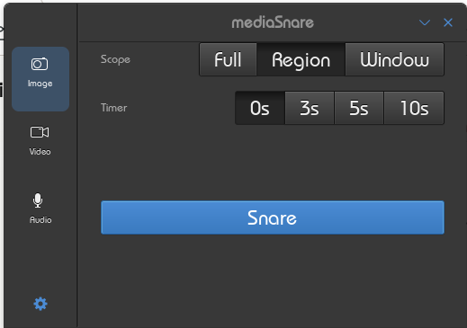
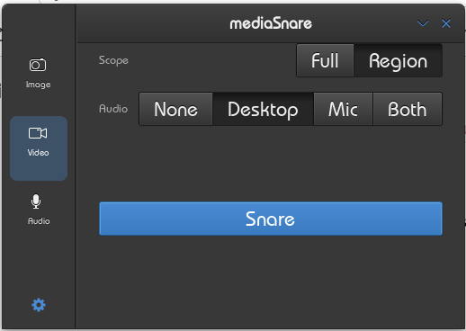
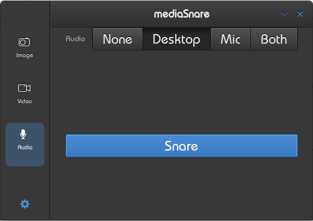

# mediaSnare

Screen, video, and audio capture for Linux.

Replaces `gnome-screenshot` and Kazam with a single native tool —
still image capture, screen recording with audio, and standalone audio
recording from a minimal GTK4 interface. X11 primary, Wayland ready
via PipeWire when desktop portal backends are available.

Developed for [Lean Linux](https://github.com/archerprojects) by
[archerprojects](mailto:archer.projects@proton.me).

---

## Screenshots

| Image | Video | Audio |
|---|---|---|
|  |  |  |

---

## Features

### Image capture
- Full screen, region (draggable on-screen selector — drag out an area,
  fine-tune with resize handles, confirm with the camera button or Enter),
  or focused window
- Formats: PNG, JPG, WebP
- Copy to clipboard (toggleable)
- Desktop notification on capture
- Timer: 0s / 3s / 5s / 10s countdown
- Optional Save As dialog for renaming

### Video capture
- Full screen or region recording
- Formats: MP4 (H.264), MKV (H.264), WebM (VP8)
- Audio sources: desktop monitor, microphone, both, or none
- Floating recording control bar — Record, Pause, Stop
- Bar positions outside capture region automatically
- VA-API hardware acceleration detected at runtime (offered as MP4 GPU
  variant when available)

### Audio capture
- Standalone recording from desktop audio, microphone, or both
- Formats: OGG/Opus, MP3
- Same floating control bar as video

### Session support
- X11 — primary target, fully functional via ximagesrc and Cinnamon
  shell D-Bus APIs
- Wayland — image capture works via xdg-desktop-portal; video recording
  activates automatically when the compositor's ScreenCast portal backend
  becomes available

---

## Prerequisites

### Runtime
- GTK4 >= 4.14
- libadwaita >= 1.5
- GStreamer >= 1.22 with plugins-base, plugins-good, plugins-ugly
- gstreamer1.0-pipewire, libpipewire-0.3-0
- xdg-desktop-portal
- PulseAudio or pipewire-pulse (audio capture)

### Recommended
- `gstreamer1.0-vaapi` — hardware-accelerated H.264 encoding
- `wmctrl` — recording bar always-on-top
- `xdotool` — recording bar positioning

### Build
- Rust >= 1.80
- Meson >= 1.0
- pkg-config
- `libgtk-4-dev`, `libadwaita-1-dev`
- `libgstreamer1.0-dev`, `libgstreamer-plugins-base1.0-dev`

---

## Building

Build .deb package (no install):

```bash
meson setup --wipe _build && ninja -C _build && bash build-aux/build-deb.sh _build dist
```

The .deb is written to `dist/`.

Install manually:

```bash
sudo dpkg -i "$(ls -t dist/mediasnare_*.deb | head -1)"
```

---

## Configuration

Preferences are accessible via the in-app settings dialog (gear icon).
Settings stored via GSettings under `org.archerprojects.mediaSnare`.

---

## Planned
- Global hotkey for start/stop recording
- Wayland video recording (pending Cinnamon ScreenCast portal backend)

---

## License

GPL-3.0-or-later. See [LICENSE](LICENSE).

---

Developed for Lean Linux by archerprojects (archer.projects@proton.me)
https://github.com/archerprojects/mediaSnare
